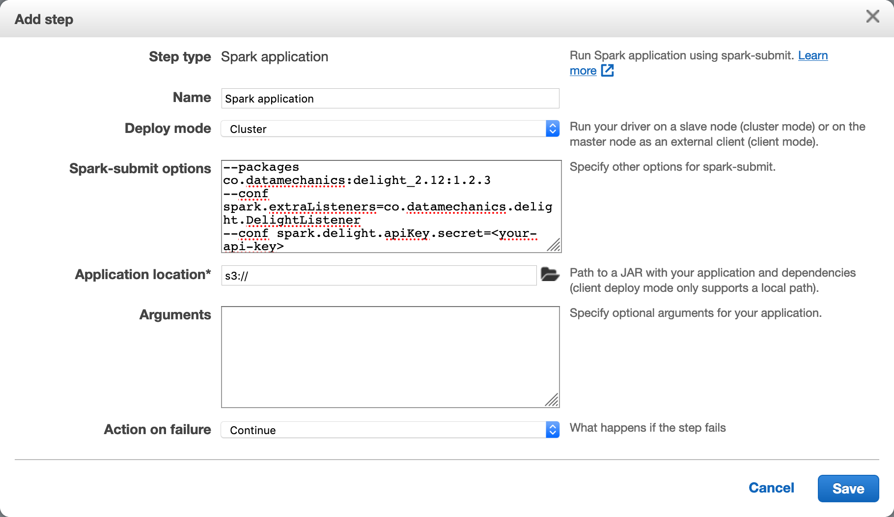

# Data Mechanics Delight

[Data Mechanics Delight](https://www.datamechanics.co/delight) is a replacement for the Spark UI to help debugging Spark performance.
Read this [blog post](https://www.datamechanics.co/blog-post/building-a-better-spark-ui-data-mechanics-delight) to learn more about it.

Data Mechanics Delight is not ready yet, we're actively working on it.
Right now Data Mechanics Delight is a free Spark history server, and that's already a lot!

Because Delight is packaged as a [SparkListener](https://jaceklaskowski.gitbooks.io/mastering-apache-spark/spark-scheduler-SparkListener.html), you can install it on any platform and you'll have a ready-to-use Spark history server for your past applications.

## Installation

To install Data Mechanics Delight on your Spark application,

- go to [Data Mechanics Delight](https://www.datamechanics.co/delight), create an account and generate an API key
- instrument your Spark submit command or the equivalent for your platform to run Data Mechanics Delight

Below we detail instructions for different platforms:

- AWS EMR
- Databricks
- Generic platform: Spark submit
- Local run

Let us know if you'd like instructions for other platforms!

In the rest of this document, we assume that you have generated an API key on [Data Mechanics Delight](https://www.datamechanics.co/delight).

### AWS EMR

They are 2 ways to run a EMR spark cluster (aka launch mode).
This configuration will have a direct impact on how you install Delight
#### Launch mode: Cluster
You should follow the documentation about Spark submit
#### Launch mode: Step execution
Add a step of type `Spark application` then click on the `Configure` button


In the text box named `Spark-submit options`, you need to had the following lines:
```java
--packages co.datamechanics:delight_2.12:1.2.3
--conf spark.extraListeners=co.datamechanics.delight.DelightListener
--conf spark.delight.apiKey.secret=<your-api-key>
```

### Databricks

TODO

### Generic platform: Spark submit

If you run Spark applications directly with the [`spark-submit` CLI](https://spark.apache.org/docs/latest/submitting-applications.html#launching-applications-with-spark-submit), please add the following to your CLI options:

- `--packages co.datamechanics:delight_2.12:1.2.3` (TODO)
- `--conf spark.delight.apiKey.secret=<your-api-key>`

A real-world example of submission instrumented with Data Mechanics Delight would look like this:

```bash
# From the root folder of a Spark distribution
./bin/spark-submit \
  --class org.apache.spark.examples.SparkPi \
  --master yarn \
  --packages co.datamechanics:delight_2.12:1.2.3 \ # TODO
  --conf spark.delight.apiKey.secret=<replace-with-your-api-key> \
  --conf spark.extraListeners=co.datamechanics.delight.DelightListener \
  --deploy-mode cluster \
  --executor-memory 20G \
  --num-executors 50 \
  /path/to/examples.jar \
  1000
```

### Local run

You can try Data Mechanics Delight with a local run on your machine.

Just [download a Spark distribution](https://spark.apache.org/downloads.html) and run an instrumented Spark submit from the root folder.

Here's a working example for Spark 3.0.1:

```bash
# From the root folder of the Spark 3.0.1 distribution
./bin/spark-submit \
  --class org.apache.spark.examples.SparkPi \
  --master 'local[2]' \
  --packages co.datamechanics:delight_2.12:1.2.3 \ # TODO
  --conf spark.delight.apiKey.secret=<replace-with-your-api-key> \
  --conf spark.extraListeners=co.datamechanics.delight.DelightListener \
  examples/jars/spark-examples_2.12-3.0.1.jar \
  100
```

## Data Mechanics Delight configurations

| Config                          | Default value    | Explanation                                                                                                                                                                     |
| :------------------------------ | :--------------- | :------------------------------------------------------------------------------------------------------------------------------------------------------------------------------ |
| `spark.delight.apiKey.secret`   | (none)           | An API key to authenticate yourself with Data Mechanics Delight. If the API key is missing, the listener will not stream events                                                 |
| `spark.delight.appNameOverride` | `spark.app.name` | The name of the app that will appear in Data Mechanics Delight. This is only useful if your platform does not allow you to set `spark.app.name` (ex: Databricks (TODO verify)). |

### Advanced configurations

We've listed more technical configurations in this section for completeness.
You should not need to change the values of these configurations though, so drop us a line if you do, we'll be interested to know more!

| Config                                                  | Default value                                   | Explanation                                                                                                                                                                                                                               |
| :------------------------------------------------------ | :---------------------------------------------- | :---------------------------------------------------------------------------------------------------------------------------------------------------------------------------------------------------------------------------------------- |
| `spark.delight.collector.url`                           | https://api.delight.datamechanics.co/collector/ | URL of the Data Mechanics Delight collector API                                                                                                                                                                                           |
| `spark.delight.buffer.maxNumEvents`                     | 1000                                            | The number of Spark events to reach before triggering a call to Data Mechanics Collector API. Special events like job ends also trigger a call.                                                                                           |
| `spark.delight.payload.maxNumEvents`                    | 10000                                           | The maximum number of Spark events to be sent in one call to Data Mechanics Collector API.                                                                                                                                                |
| `spark.delight.heartbeatIntervalSecs`                   | 10s                                             | (Internal config) the interval at which the listener send an heartbeat requests to the API. It allow us to detect if the app was prematurely finished and start the processing ASAP                                                       |
| `spark.delight.pollingIntervalSecs`                     | 0.5s                                            | (Internal config) the interval at which the object responsible for calling the API checks whether there are new payloads to be sent                                                                                                       |
| `spark.delight.maxPollingIntervalSecs`                  | 60s                                             | (Internal config) upon connection error, the polling interval increases exponentially until this value. It returns to its initial value once a call to the API passes through                                                             |
| `spark.delight.maxWaitOnEndSecs`                        | 10s                                             | (Internal config) the time the Spark application waits for remaining payloads to be sent after the event `SparkListenerApplicationEnd`. Not applicable in the case of Databricks                                                          |
| `spark.delight.waitForPendingPayloadsSleepIntervalSecs` | 1s                                              | (Internal config) the interval at which the object responsible for calling the API checks whether there are new remaining to be sent, after the event `SparkListenerApplicationEnd` is received. Not applicable in the case of Databricks |
